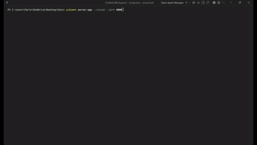
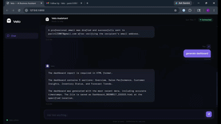

<div align="center">


# 👻 Velo — AI Business Assistant

**A multi-agent AI system that automates your business operations through natural language.**  
Send emails, search the web, track clients, set reminders, generate reports — all from one chat.

<br/>

[](https://python.org)
[](https://fastapi.tiangolo.com)
[](https://groq.com)
[](https://mistral.ai)
[](https://tavily.com)
[](LICENSE)

</div>

---

## 🎬 Demo





---

## 🤖 How It Works

Every message you send runs through a **5-agent pipeline**:

```
Your Input
    ↓
🎯 Intake Agent     →  Understands intent, extracts entities, classifies task
    ↓
🗺️  Planner Agent   →  Breaks task into clear execution steps
    ↓
⚡ Executor Agent   →  Runs the right tool (email, search, tracker, etc.)
    ↓
🔍 Critic Agent     →  Reviews output quality, saves lessons learned
    ↓
🧠 Memory Agent     →  Compresses conversation into session memory
    ↓
Response to You
```

---

## ✨ Features

| Feature | Description |
|---------|-------------|
| 📧 **Email Automation** | Drafts and sends professional emails via Gmail SMTP |
| 🔍 **Web Search** | Real-time search powered by Tavily API |
| 👥 **Client Tracker** | Add, update, and manage clients in SQLite database |
| ⏰ **Reminder Setter** | Schedule reminders with email delivery |
| 📊 **Dashboard** | Live HTML dashboard with charts, task stats, and client data |
| 📁 **Excel Reports** | Auto-generates styled multi-sheet .xlsx business reports |
| 📄 **PDF Reports** | Clean PDF generation for business summaries |
| 🧠 **Memory System** | Remembers past conversations per session |
| 💡 **Self-Learning** | Critic agent learns from mistakes and improves over time |

---

## 🛠️ Tech Stack

| Layer | Technology |
|-------|-----------|
| **Backend** | FastAPI, Python 3.10+ |
| **LLM - Intake** | Groq — LLaMA 3.1 8B Instant |
| **LLM - Planner/Executor/Critic** | Mistral AI — mistral-small / mistral-large |
| **LLM - Memory** | Groq — GPT OSS 20B |
| **Web Search** | Tavily API |
| **Database** | SQLite |
| **Email** | Gmail SMTP |
| **Reports** | openpyxl, fpdf |
| **Frontend** | Pure HTML, CSS, JS |

---

## 🚀 Getting Started

### 1. Clone the repo

```bash
git clone https://github.com/yourusername/velo.git
cd velo
```

### 2. Install dependencies

```bash
pip install -r requirements.txt
```

### 3. Run the server

```bash
uvicorn server:app --reload --port 8000
```

### 4. Open in browser

```
http://localhost:8000
```

First time → Setup page appears. Enter your API keys. Done. Next visit goes straight to chat.

---

## 🔑 API Keys Required

| Key | Get it from |
|-----|------------|
| Groq API Key | [console.groq.com](https://console.groq.com/keys) |
| Mistral API Key | [console.mistral.ai](https://console.mistral.ai/api-keys/) |
| Tavily API Key | [app.tavily.com](https://app.tavily.com/home) |
| Gmail + App Password | [myaccount.google.com/apppasswords](https://myaccount.google.com/apppasswords) |

---

## 📁 Project Structure

```
Velo/
├── agents/
│   ├── intake_agent.py       # Task classification
│   ├── planner_agent.py      # Step planning
│   ├── executor_agent.py     # Tool execution
│   ├── memory_agent.py       # Session memory
│   └── critic_agent.py       # Quality review
├── tools/
│   ├── email_sender.py       # Gmail integration
│   ├── web_search.py         # Tavily search
│   ├── client_tracker.py     # SQLite client DB
│   ├── reminder_setter.py    # Reminder system
│   ├── excel.py              # Excel generation
│   ├── pdf_generator.py      # PDF generation
│   └── file_reader.py        # File reading
├── pipelines/
│   ├── task_pipeline.py      # Main agent pipeline
│   └── output_stage.py       # Dashboard generator
├── db/
│   └── model.py              # DB models
├── ui/
│   ├── velo-chat.html        # Chat interface
│   └── velo-setup.html       # Setup page
├── server.py                 # FastAPI server
├── main.py                   # CLI entry point
└── requirements.txt
```

---

## 💬 Example Tasks

```
Search for latest AI news today
Send an email to john@gmail.com about our meeting tomorrow at 10am
Add client Sarah Connor sarah@gmail.com to tracker
Generate dashboard
Generate excel report
Set a reminder to follow up with the client
```

---

## 📊 Agent Token Usage

Each pipeline run uses approximately **800–1200 tokens** across all agents combined — optimized for speed and cost efficiency.

---

## 🙌 Built By

**Parin** — Built as a real-world AI automation project combining multi-agent architecture, business tooling, and full-stack web development.

[](https://github.com/parin0127-png)
[](https://www.linkedin.com/in/parin-prajapati-5b0579376/)

🌐 Live Demo: https://velo-n4aj.onrender.com

---

<div align="center">
  <sub>Made with 👻 and a lot of tokens</sub>
</div>